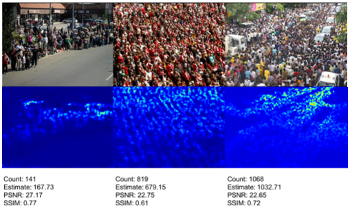

# 基于PP-Human的人流量可视化数据大屏

## 项目概述

在超大城市的管理中，如何应对人口密度增大所造成的拥挤、踩踏等事故是不可回避的问题。一旦人流密度超过场所所能容纳上限，后续的风险往往难以管控。例如在10月29日的韩国梨泰院发生的踩踏事故共造成156人丧生，造成了不可挽回的损失。本项目旨在对特定区域的人流量进行智慧监控，以辅助管理者在事故发生前及时实施管控，以减少甚至彻底消除大人流量带来的风险。

基于[PP-Human]([PaddleDetection/deploy/pipeline at release/2.5 · PaddlePaddle/PaddleDetection (github.com)](https://github.com/PaddlePaddle/PaddleDetection/tree/release/2.5/deploy/pipeline))行人分析工具，我们使用Django+Pyecharts完成动态数据大屏的开发, 完成了人流数据的采集与入库, 打架、摔倒、打电话等事件的警报收集与可视化, 并添加了口罩检测。 对于边缘端的CPU部署性能优化，我们采用Openvino+ONNX的方案，并同时提供各种大小尺寸的模型，以满足不同设备的算力限制。

本项目旨在实现对某一特定监控区域进出口人流量的检测与记录，而[PP-Human]([PaddleDetection/deploy/pipeline at release/2.5 · PaddlePaddle/PaddleDetection (github.com)](https://github.com/PaddlePaddle/PaddleDetection/tree/release/2.5/deploy/pipeline))为我们提供了全套的解决方案。基于[PP-Human]([PaddleDetection/deploy/pipeline at release/2.5 · PaddlePaddle/PaddleDetection (github.com)](https://github.com/PaddlePaddle/PaddleDetection/tree/release/2.5/deploy/pipeline))完善的pipeline，我们使用Django和pyecharts开发了可视化前端；并针对推理速度进行了一定优化，替换了原有的PaddleInference推理方式，使用Openvino以提高pipeine在CPU上的运行速度。


## 功能概览


主要支持的功能与PP-Human相同：

| 功能                   | 方案                 | 模型              |
| ---------------------- | -------------------- | ----------------- |
| 出入计数，区域闯入识别 | 行人检测与追踪       | PP-YOLOE OC-SORT  |
| 行人属性识别           | 单人图像多分类       | PP-HGNet PP-LCNet |
| 打电话                 | 单人图像分类行为识别 | PP-HGNet          |
| 抽烟                   | 单人目标检测行为识别 | PP-YOLOE          |
| 打架识别               | 视频分类行为识别     | PP-TSM            |
| 摔倒识别               | 骨骼关键点行为识别   | HRNet ST-GCN      |


在**数据采集与入库**过程中，根据任务性质不同，采用了两种方案：

- 定时采集：对于每个frame推理都会产生的人员计数数据及视频图像等，采用定时采集入库的方式。即定时对实时推理结果进行记录并存入数据库。
- 即时采集：对于偶发的警告事件（如摔倒、打架等），采用即时入库的方式。即一旦检测到事件发生就通过requests将事件发送给后端。

在**数据可视化及事件警报**的展示上，我们使用Django与Echarts配合完成。使用Django的`StreamingHttpResponse`实现视频流的传输，并用ajax定时更新网页上的图表与警报信息，实现动态数据大屏的基础功能。


*数据即时动态更新示例

同时根据具体应用落地的差异，数据可视化大屏中预留了各种图表的位置，可以根据需求自行设计所需的数据图表进行展示，丰富大屏功能，实现个性化功能定制。

## Pipeline方案

为适应不同人流量密度及设备算力对检测跟踪模型性能的影响，在PP-Human的基础上我们提供多种不同方案可供参考选择。

### 云端方案

使用默认的PP-Human模型Pipeline方案，检测精度高，适合设备算力高、人流密度相对较低的场景

| 功能                   | 方案                 | 模型              |
| ---------------------- | -------------------- | ----------------- |
| 出入计数，区域闯入识别 | 行人检测与追踪       | PP-YOLOE OC-SORT  |
| 行人属性识别           | 单人图像多分类       | PP-HGNet PP-LCNet |
| 打电话                 | 单人图像分类行为识别 | PP-HGNet          |
| 抽烟                   | 单人目标检测行为识别 | PP-YOLOE          |
| 打架识别               | 视频分类行为识别     | PP-TSM            |
| 摔倒识别               | 骨骼关键点行为识别   | HRNet ST-GCN      |

### 边缘方案

为适应算力受限的场景，更换了部分推理速度较慢的模型（行人检测模型与骨骼关键点模型）

| 功能                   | 方案                 | 模型                     |
| ---------------------- | -------------------- |------------------------|
| 出入计数，区域闯入识别 | 行人检测与追踪       | **PP-Picodet** OC-SORT |
| 行人属性识别           | 单人图像多分类       | PP-HGNet PP-LCNet      |
| 打电话                 | 单人图像分类行为识别 | PP-HGNet               |
| 抽烟                   | 单人目标检测行为识别 | PP-YOLOE               |
| 打架识别               | 视频分类行为识别     | PP-TSM                 |
| 摔倒识别               | 骨骼关键点行为识别   | **PP-Tinypose** ST-GCN |

### 人流密度方案

当人流密度较高时，行人互相遮挡比较严重，为不损失追踪等功能，将行人全身检测模型替换为行人头部检测模型。


当人流密度极高时，检测跟踪模型效果较差，使用热力图方式估计人流较为精确（CSRNet）



## 边缘部署优化

由于本项目所使用pipeline模型众多，各自算力需求也各有不同，在CPU条件下可能不能够在开启所有功能的条件下保持良好的性能，我们使用Openvino+多种模型方案的形式尽量优化pipeline的推理性能。所有规格方案中的模型都可以自动下载或已经包括在本repo中。您也可以前往PaddleDetection挑选自己所需的模型规格并训练调优。

PP-human模型库：[链接](https://github.com/PaddlePaddle/PaddleDetection/blob/release/2.5/deploy/pipeline/docs/tutorials/PPHuman_QUICK_STARTED.md#%E6%A8%A1%E5%9E%8B%E4%B8%8B%E8%BD%BD)

目前已经完成所有功能模块的Openvino推理支持！！！

|              功能               |        模型         | 替换前fps | 替换后fps |
| :-----------------------------: | :-----------------: | :-------: | :-------: |
|     行人检测与跟踪(640*640)     |     PP-YOLOe-s      |   2.77    |   11.11   |
|     行人检测与跟踪(320*320)     |       Picodet       |     /     |   35.02   |
|  行人检测+基于视频分类打架识别  | PP-YOLOe-s + pp-TSM |     /     |   10.30   |
| 行人检测+基于图像分类打电话识别 |  Picodet + PPHGNet  |     /     |   7.68    |

*以上均在Intel AiBox(11th Gen Intel(R) Core(TM) i5-1135G7 @ 2.40GHz  )上测试所得, 包括所有前后处理流程

**行人检测320输入模型速度提升明显, 但对视野较广的镜头识别效果较差


*英特尔AI Box

## 快速开始

项目链接：[【OpenVino】PP-Human人流量大屏 - 飞桨AI Studio (baidu.com)](https://aistudio.baidu.com/aistudio/projectdetail/4694859)

### 环境配置

整个项目可以在项目挂载的数据集中下载，下载解压完成后

```shell
# 切换到解压目录
cd crowd_vis

# 我已经把依赖全部写在requirements.txt中，直接pip安装即可
# paddlepaddle没有写入，没有安装的话自行安装
pip install -r requirements.txt
```

### 数据库配置

首先自行安装mysql数据库，并建立一个名为`crowdvis`的数据库

```sql
create database crowdvi default charset=utf8;
```

之后修改`crowd_vis/settings.py`中的数据库连接设置：

填入你的mysql数据库用户名和密码

```python
DATABASES = {
    'default': {
        'ENGINE': 'django.db.backends.mysql',
        'NAME': 'crowdvis',
        'HOST': '127.0.0.1',
        'PORT': 3306,
        'USER': 'root',
        'PASSWORD': 'crowdvis',
    }
}
```

最后清除`dbmodel/migrations`中的多余文件，并同步数据库：

```shell
python manage.py makemigrations
python manage.py migrate
```

### 启动服务

命令行运行：

```shell
python manage.py runserver
```

出现以下内容即启动成功

```
System check identified no issues (0 silenced).
August 19, 2022 - 22:53:05
Django version 3.2.15, using settings 'crowd_vis.settings'
Starting development server at http://127.0.0.1:8000/
Quit the server with CONTROL-C.
```

随后启动你的浏览器，输入`http://127.0.0.1:8000/`即可访问


## 未来工作

- 提供更多方案的检测
- 人流量数据时序相关，考虑接入机器学习的时序模型实现对人流的预警与预测
- 提供更多实用数据分析图表